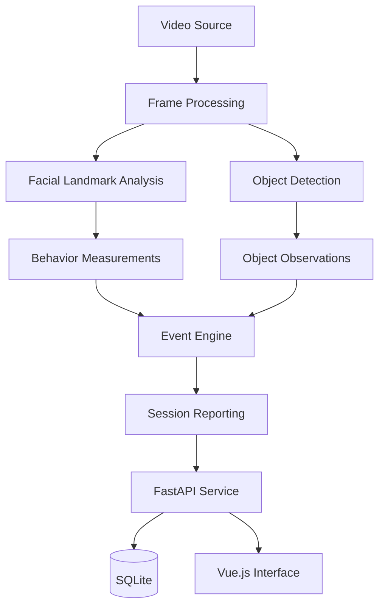
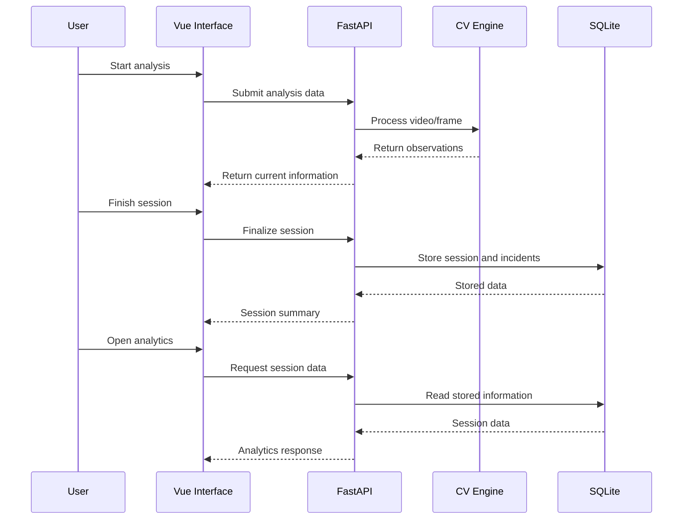
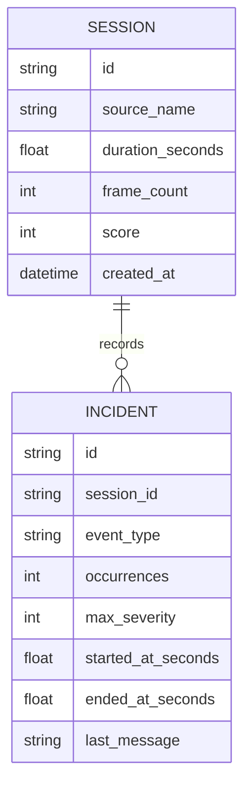
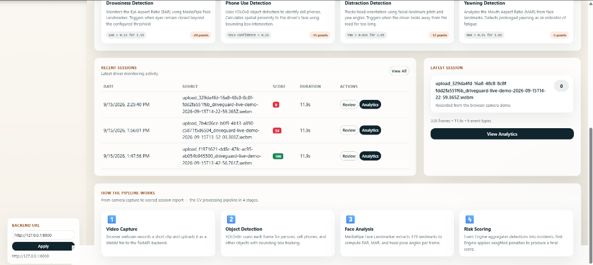
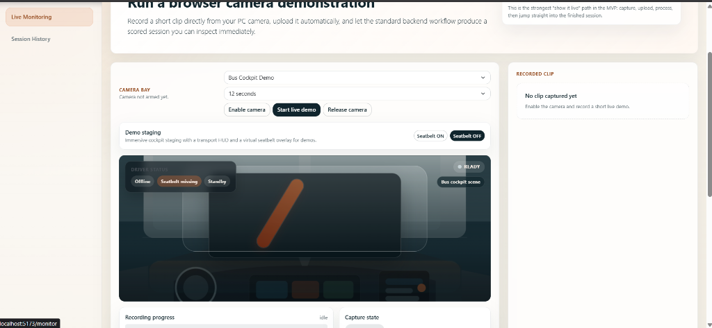
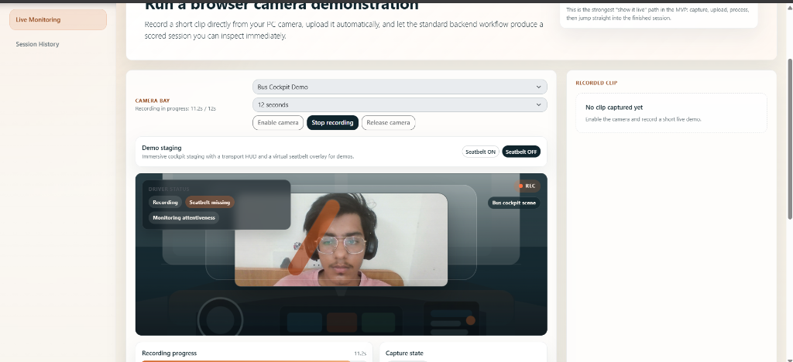
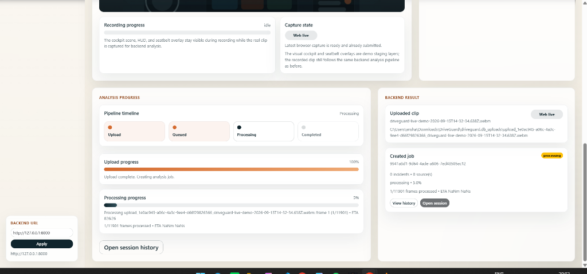
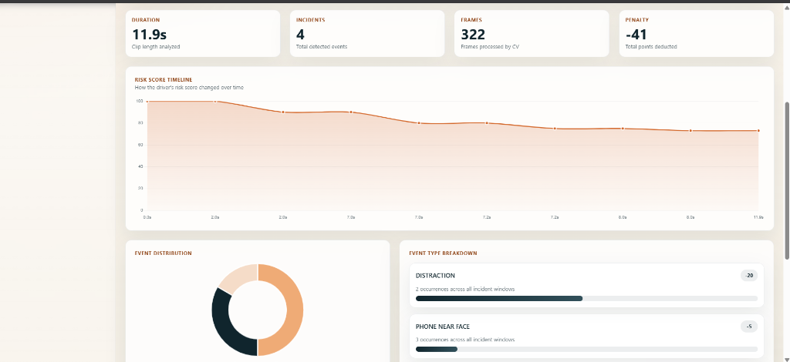

# TravelSafe
## Real-Time Driver Behavior Monitoring Using Computer Vision

**Course:** Computer Vision (CSE3010)  
**Project Type:** Academic Software Prototype  
**Student Name:** Aryan Mauryakant 
**Registration Number:** 24BAI10142  

---

# 1. Abstract

TravelSafe is a camera-based driver monitoring application that uses computer vision to observe visual indicators of driver fatigue and distraction.

Instead of depending on specialized automotive hardware, the system works with ordinary video input. A processing pipeline examines the driver's face using MediaPipe landmarks and performs object detection using YOLOv8. Measurements derived from the face are used to observe eye closure, mouth movement, and head orientation, while object detection is used for identifying relevant objects such as a mobile phone.

The detection results are passed through an event-processing layer that maintains information across consecutive frames. This allows the application to represent ongoing behavior as incidents instead of producing a separate alert for every frame. Session information and the resulting analysis are made available through a FastAPI backend and a Vue.js web interface.

The project demonstrates the integration of computer vision inference, event handling, persistence, APIs, and frontend visualization in one application.

---

# 2. Introduction

A driver's condition can change during a journey. Fatigue, prolonged eye closure, yawning, looking away from the road, and interacting with a phone are examples of behaviors that can potentially reduce driving awareness.

TravelSafe explores how software-based computer vision can be used to observe such behaviors through a conventional camera. The objective is not to control a vehicle, but to build an accessible monitoring prototype that can process video, identify predefined behavioral patterns, and present the resulting information in a structured form.

The application is organized around a computer vision engine and an application layer. The vision engine performs the measurements and detections, while the backend and frontend provide mechanisms for running sessions, storing results, and reviewing the collected information.

---

# 3. Problem Definition

The project addresses the following problem:

> How can a standard camera and lightweight computer vision techniques be combined to monitor observable signs of driver fatigue, distraction, and phone usage in a real-time software application?

A useful solution needs to deal with more than object detection alone. Driver-state indicators such as closed eyes or a yawn may last for several frames, and therefore the system must also reason about the persistence of an observation over time.

The project consequently combines:

- Facial landmark extraction
- Geometric facial measurements
- Head-orientation analysis
- Object detection
- Temporal event handling
- Session aggregation
- Web-based result visualization

---

# 4. Project Goals

The implementation was designed around the following goals:

### 4.1 Camera-Based Monitoring

Allow the system to work with a normal webcam instead of requiring specialized vehicle hardware.

### 4.2 Multiple Behavioral Indicators

Use more than one visual signal so that the monitoring pipeline can examine different types of driver behavior.

### 4.3 Temporal Event Handling

Avoid treating every frame as an independent incident. Events should have a beginning, continuation, and completion.

### 4.4 Session-Level Information

Combine the observations generated during a run into a record that can be reviewed after the session.

### 4.5 Application Integration

Connect the computer vision pipeline to a backend API and a browser-based interface.

---

# 5. Technologies Used

## 5.1 OpenCV

OpenCV is used for video handling and frame-level computer vision operations. It provides the basic interface through which video frames are read and passed into the analysis pipeline.

## 5.2 MediaPipe

MediaPipe provides facial landmark information. The landmark coordinates form the basis for calculating eye and mouth measurements and for estimating facial orientation.

## 5.3 YOLOv8

YOLOv8 is used for object detection. Within the driver-monitoring workflow, object detections can be used to identify relevant objects such as a mobile phone.

## 5.4 Python

Python is used for the computer vision engine, event processing, backend services, and supporting utilities.

## 5.5 FastAPI

FastAPI provides the HTTP API used by the application. It connects the processing layer with the frontend and exposes operations related to analysis sessions and stored information.

## 5.6 SQLAlchemy and SQLite

SQLAlchemy provides the database abstraction layer, while SQLite provides local storage for session and incident information.

## 5.7 Vue.js

Vue.js is used to construct the browser-based application interface.

## 5.8 Chart.js

Chart.js is used for presenting analytical information graphically in the frontend.

---

# 6. Overall System Design

The application can be viewed as four cooperating layers:



The important design principle is the separation of **observation** from **event interpretation**.

For example, a low eye-opening measurement is an observation. A prolonged period satisfying the drowsiness condition is treated as an event. This separation makes the pipeline easier to maintain and allows the thresholds and event rules to be modified independently of video acquisition.

---

# 7. Driver-State Analysis

## 7.1 Eye Closure

The system uses facial eye landmarks to derive the Eye Aspect Ratio (EAR).

EAR represents the relative vertical opening of the eye compared with its horizontal extent. When the eyes close, the vertical distances decrease and the ratio changes accordingly.

A simplified representation is:

\[
EAR = \frac{d_{vertical1} + d_{vertical2}}
{2d_{horizontal}}
\]

A value below the configured threshold for a sustained interval can produce a drowsiness-related event.

The duration condition is important because an occasional blink should not automatically be treated as prolonged drowsiness.

---

## 7.2 Yawning

Mouth landmarks are used to calculate the Mouth Aspect Ratio (MAR).

A simplified form is:

\[
MAR = \frac{\text{vertical mouth distances}}
{\text{horizontal mouth distance}}
\]

An increase in the ratio indicates a wider mouth opening. When the opening satisfies the configured conditions over a suitable period, the event engine can record a possible yawn.

---

## 7.3 Head Movement

The facial landmark information is also used to estimate changes in head orientation.

Two important components are:

- **Yaw:** horizontal rotation of the head.
- **Pitch:** vertical rotation of the head.

The system can use configured limits to determine when the observed orientation represents a possible distraction event.

This is a behavioral approximation based on camera observations; it does not determine why the driver moved their head.

---

## 7.4 Phone Detection

The object-detection stage processes video frames using YOLOv8.

When a phone is detected with sufficient confidence, the observation is passed to the event-processing stage. Repeated detections can therefore contribute to the corresponding session incident rather than being treated as unrelated events.

---

# 8. Event Engine

The event engine is responsible for converting raw measurements into meaningful behavioral events.

A frame can contain several observations at the same time. For example:

```text
Frame
 ├── Eye measurement
 ├── Mouth measurement
 ├── Head orientation
 └── Object detections
```

These observations are evaluated by the event logic.

The engine maintains state so that behaviors spanning multiple frames can be represented correctly.

For an ongoing event, the general process is:

```text
Observation detected
        ↓
Condition satisfied
        ↓
Event starts
        ↓
Condition remains satisfied
        ↓
Event continues
        ↓
Condition ends
        ↓
Event finalized
```

This approach is particularly useful for behaviors such as prolonged eye closure and yawning.

---

# 9. Session and Risk Information

Each analysis run is treated as a session.

A session can contain information including:

- Input source
- Processing duration
- Number of processed frames
- Overall score
- Creation time
- Associated incidents

Incidents can contain:

- Event type
- Number of occurrences
- Severity information
- Start position in the video
- End position in the video
- Descriptive information

The reporting component aggregates these observations so that the user receives a session-level view instead of a long list of individual frame detections.

The resulting numerical score is an application-level summary of detected events. It should not be interpreted as a certified measure of a person's ability or fitness to drive.

---

# 10. Backend Design

The backend is implemented using FastAPI.

Its main purpose is to act as the communication layer between the frontend and the processing/storage components.

A simplified interaction is:



The backend therefore keeps the frontend independent from the implementation details of the computer vision algorithms.

---

# 11. Frontend Design

The frontend is implemented using Vue 3.

The interface is organized around the monitoring workflow rather than exposing the internal computer vision implementation to the user.

The dashboard provides access to:

- Live monitoring
- Video analysis
- Previous sessions
- Incident information
- Analytical views
- Session details
- Report-related functionality

The frontend communicates with the FastAPI backend to submit analysis requests and retrieve session information.

---

# 12. Database Structure

The application maintains two main conceptual entities: sessions and incidents.



A single session may contain zero or more incidents. This relationship makes it possible to inspect both the complete analysis run and the individual behavioral events associated with it.

---

# 13. Processing Recorded Videos

TravelSafe can operate on pre-recorded material.

The general sequence is:

1. Open the input video.
2. Read the available frames.
3. Extract facial landmarks.
4. Calculate driver-state measurements.
5. Run object detection.
6. Pass observations to the event engine.
7. Update session information.
8. Finalize the session when processing is complete.
9. Store the resulting information.

This mode is useful for testing the system repeatedly with the same input and comparing changes to the processing logic.

---

# 14. Live Monitoring

The same core processing concepts can be applied to a webcam stream.

The live workflow consists of:

```text
Webcam
  ↓
Frame Capture
  ↓
Vision Processing
  ↓
Behavior Detection
  ↓
Event Engine
  ↓
Current Session State
  ↓
Dashboard
```

The objective is to provide current information without requiring the user to manually inspect each frame.

---

# 15. Command-Line Operation

In addition to the web application, the project provides a command-line entry point.

A recorded video can be processed with:

```bash
python main.py run samples/demo.mp4
```

Live processing can be started with:

```bash
python main.py run 0
```

Here, `0` refers to the default camera device.

The CLI is useful when only the computer vision processing is required and the browser interface is not necessary.

---

# 16. Testing Strategy

Testing is divided into logic-level checks and API-level checks.

### 16.1 Event and Reporting Tests

The event and reporting components can be tested with controlled inputs to verify:

- Correct event activation
- Correct event termination
- Handling of repeated observations
- Severity calculations
- Session aggregation
- Score generation

### 16.2 API Tests

The FastAPI test client can be used to verify application endpoints and expected responses.

Examples include checking session operations and incident-related endpoints.

### 16.3 Manual Testing

The complete workflow can also be evaluated using live camera input.

Testing different camera positions and lighting conditions is useful because facial landmark quality and object detection confidence can change with the recording environment.

---

# 17. Development Challenges

## 17.1 Video Timing

Video files created by browser recording tools may contain timing metadata that does not behave as expected when interpreted purely through frame-rate information.

For this reason, the processing workflow uses timing information available from OpenCV rather than relying only on an assumed frame rate.

## 17.2 Persistent Events

A behavioral condition can remain active across many frames.

Without state management, a three-second event could incorrectly appear as dozens or hundreds of separate incidents.

The event engine therefore maintains information about the current state of each monitored condition.

## 17.3 Combining Different Detectors

Facial analysis and object detection produce different forms of output.

The system needs a common event-processing layer capable of consuming both types of observations and producing a consistent session representation.

---

# 18. Interface Demonstration

The following images show the different parts of the application.

## 18.1 Main Dashboard




## 18.2 Monitoring Workflow








## 18.3 Previous Sessions


## 18.4 Analytical View



## 18.5 Session Information


---

# 19. Limitations

The current system has several practical limitations.

### Environmental Conditions

Lighting, shadows, camera placement, and image quality can influence facial landmark detection and object recognition.

### Camera Position

A camera positioned too far from the driver or at an unsuitable angle can reduce the quality of facial measurements.

### Occlusion

Glasses, hands, masks, or other objects covering parts of the face can affect landmark-based analysis.

### Model Dependence

Object detection performance depends on the capabilities and training data of the selected YOLO model.

### Behavioral Interpretation

The system identifies visual patterns. It cannot establish the driver's actual mental or physical state with certainty.

For these reasons, TravelSafe should be regarded as a **computer vision prototype for academic and experimental use**, not as a certified automotive safety system.

---

# 20. Future Scope

Several improvements could make the system more capable.

### Improved Temporal Modeling

A learned temporal model could analyze sequences of behavior instead of relying primarily on threshold-based event rules.

### Better Driver Tracking

Tracking could be improved to maintain more consistent observations when detections temporarily disappear.

### Additional Road-Scene Information

The system could incorporate more vehicle and road-scene detections to provide broader driving-context analysis.

### Edge Optimization

The processing pipeline could be optimized for low-power edge devices through model compression, inference optimization, or hardware acceleration.

### Expanded Session Analytics

Future versions could provide comparisons between sessions, longer-term trends, and more detailed incident analysis.

---

# 21. Conclusion

TravelSafe demonstrates a complete application built around real-time computer vision.

The project combines facial landmark measurements, object detection, event-state handling, session aggregation, database persistence, REST APIs, and a web interface. This combination allows low-level visual observations to be transformed into information that can be inspected at the session level.

The implementation provides a practical foundation for experimenting with driver-monitoring concepts while keeping the system accessible through ordinary camera hardware.

---

# 22. References

1. OpenCV Documentation — https://docs.opencv.org/
2. MediaPipe Documentation — https://developers.google.com/mediapipe
3. Ultralytics Documentation — https://docs.ultralytics.com/
4. FastAPI Documentation — https://fastapi.tiangolo.com/
5. Vue.js Documentation — https://vuejs.org/
